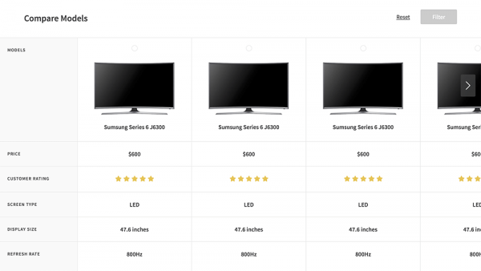
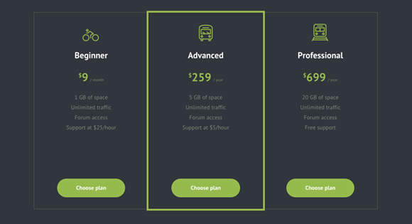

`table` 要素を使用している。参考にしたいアイデアや美しいものをピックアップして紹介し、まとめていきます。

## テーブルを固定する

列や行を固定し、中身の情報だけをスクロールさせる要件の時に参考にしたいまとめです。

### Products Comparison Table

特定の列と行が固定される使用になっており、なめらかにスクロールします。 ヘッダ部分は収縮しコンパクトになり、必要なものや比較したい対象のみを表示させるソート機能を実装しています。

[Products Comparison Table](https://codyhouse.co/gem/products-comparison-table/)

## プライスリスト

カード型などプライスリスト(料金表)のデザイン・レイアウトテクニックも多様化してきました。

### Pricing Tables Inspiration

ミニマルなインタラクションとデザインで可読性にがいいインスピレーション集。

[Pricing Tables Inspiration](http://tympanus.net/Development/PricingTablesInspiration/)

おわります。
