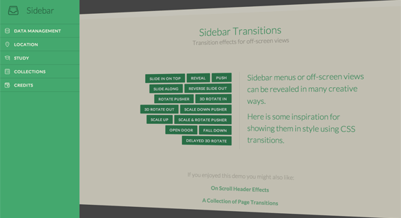

ナビゲーションに適応したい、おしゃれでかっこいいエフェクトサンプルのまとめです。

## グローバルナビゲーション

サイトの上部に固定表示したり、あらかじめ隠しておいてハンバーガーアイコンなどをトリガーに、スライドイン表示させるメインのメニューのエフェクトをまとめます。

### Inspiration for Line Menu Styles

シンプルで効果的なナビゲーションエフェクトのインスピレーション集。

[Inspiration for Line Menu Styles](http://tympanus.net/Development/LineMenuStyles/)

### Creative Link Effects

プロジェクトに取り入れやすそうな、シンプルなラインアクションなどをまとめたスタイル集。

[Creative Link Effects](http://tympanus.net/Development/CreativeLinkEffects/)

### Sidebar Transitions

トランジションをうまく使った、アニメーション集。 3d表現のダイナミックなスタイルも用意されている。

[Sidebar Transitions](http://tympanus.net/Development/SidebarTransitions/)

### Header Effects

ヘッダーナビゲーション固定レイアウト実装の際、スクロール後に縮小などのアニメーションを伴ったスタイル変更のインスピレーション。

[Header Effects](http://tympanus.net/Development/HeaderEffects/)

## Prev / Next

次のポストや前のポストに移動するナビゲーションのまとめです。

### Arrow Navigation Styles

矢印をホバーすると、サムネイルやタイトルなどのキャプションが現れるインタラクティブなスタイル集。

[ArrowNavigationStyles](http://tympanus.net/Development/ArrowNavigationStyles/)

## バレットナビゲーション

スライダーでよく実装される、アイテムの切り替えや、現在位置を知らせてくれるナビゲーションのまとめです。

### Dot Navigation Styles

よくあるサークル状のバレットスタイルで、遊びのあるアニメーションやツールチップを表示させるスタイルも用意されている。

[Dot Navigation Styles](http://tympanus.net/Development/DotNavigationStyles/)

### スライダーなどで使用される、バレットナビゲーションのスタイル・エフェクトサンプル

実装のコードなどが細やかに開設されており、シンプルでカスタマイズしやすいものがたくさん紹介されている。 サークル状や矩形、三角形のスタイルなど形状も多様。

[スライダーなどで使用される、バレットナビゲーションのスタイル・エフェクトサンプル](http://www.nxworld.net/tips/css-bullet-navigation-design.html)

おわります。
